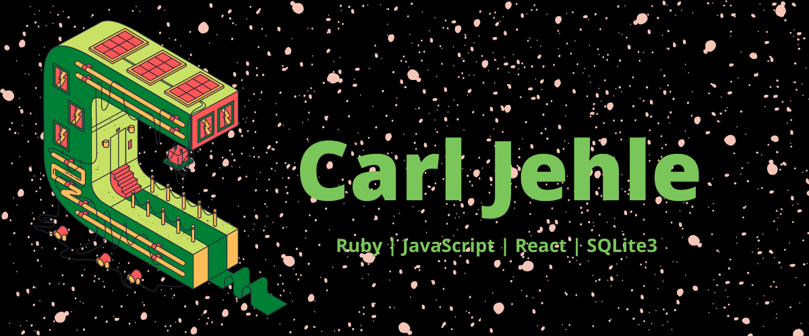

### Hey! Welcome to my GitHub page

My name is Carl and I am a full-stack software engineer who work with Ruby, JavaScript, HTML, and CSS. I am a Flatiron School alumni with loads of personal interests and hobbies. I'm looking for oppurtunities to contribute my skills and knowledge to the right team. 

---
### Stats

  
       
